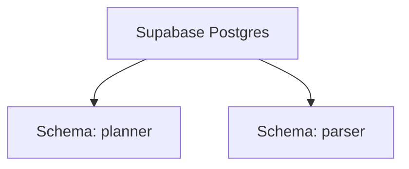
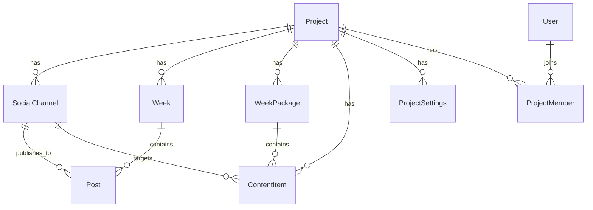
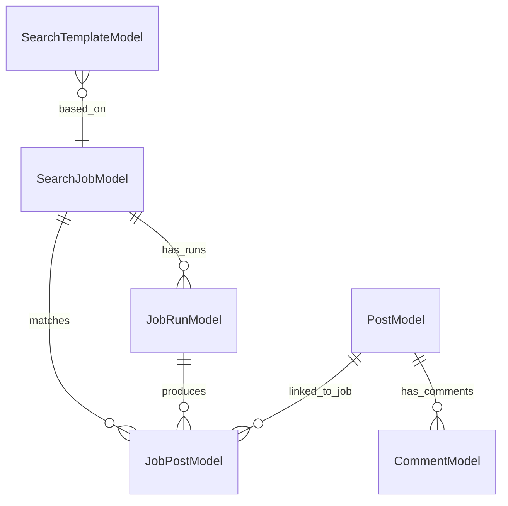

# Database Topology

## Status
Target database design for production deployment with **one Supabase Postgres project** and **two application schemas**.

## Decision
Use one Supabase Postgres instance with:
- schema `planner`
- schema `parser`

Do not use `public` for new domain tables unless there is a specific reason.

System-managed Supabase schemas remain untouched:
- `auth`
- `storage`
- `realtime`
- other Supabase internal schemas

## Why one database
This is a pragmatic choice for the current stage because:
- Supabase is already provisioned
- one connection target is easier for Railway services
- cross-domain reporting is simpler
- free / low-cost operational footprint matters right now

## Main risk of one database
The biggest risk is **resource contention**:
- parser ingestion
- parser enrichment
- parser backfills
- parser analytical queries

can affect:
- planner publication APIs
- planner web app responsiveness
- MCP response times

This architecture is acceptable if we actively manage:
- query costs
- retention
- connection pools
- schema boundaries

## Schema overview

## Schema `planner`
This schema belongs to the `Ba_post_planner` repository.

### Identity and membership
- `users`
- `project_members`
- `project_invitations`

### Project configuration
- `projects`
- `project_settings`
- `social_channels`
- `provider_keys`
- `telegram_accounts`

### Legacy planning flow
- `weeks`
- `posts`
- `week_memories`

### Operational logs
- `events`
- `agent_runs`
- `agent_iterations`

### Prompting and comments
- `prompt_settings`
- `prompt_presets`
- `comments`

### Media orchestrator / publication flow
- `quarter_plans`
- `month_arcs`
- `week_packages`
- `content_items`
- `feedback_packages`

## Schema `parser`
This schema belongs to the `reddit-parser` repository.

Based on the current parser models, it contains:

### Jobs and runs
- `search_jobs`
- `job_runs`
- `job_posts`
- `idempotency_records`

### Collected Reddit data
- `posts`
- `comments`
- `subreddit_snapshots`

### Saved research templates
- `search_templates`

## Existing planner objects
### Core planner entities

### Notable planner table notes
#### `planner.projects`
- root aggregate for most planner functionality

#### `planner.social_channels`
- stores per-channel config
- used by publication tools and direct publish flows

#### `planner.project_settings`
- already stores imported publication plan metadata:
  - `publication_plan_id`
  - `publication_plan_meta`
  - `publication_plan_assets`
  - `publication_plan_accounts`
  - `publication_plan_ongoing_rules`
  - `publication_plan_measurement`
  - `publication_plan_dependencies_matrix`

#### `planner.content_items`
- current main publication task entity for the modern flow
- links to channel, schedule, assets, status, metrics, quality report

#### `planner.events`
- good place for MCP audit events and service-level action logs

## Existing parser objects
### Parser entity graph

### Notable parser table notes
#### `parser.search_jobs`
- root job definition table
- scoped by `workspace_id`

#### `parser.job_runs`
- execution history for parser jobs

#### `parser.posts`
- canonical collected Reddit post storage
- includes enriched author, subreddit, link, and thread-level signals

#### `parser.comments`
- normalized Reddit comments

#### `parser.search_templates`
- saved recurring query definitions

## Cross-schema logical mapping
No direct foreign keys between schemas are required in v1.

Use logical mapping:
- planner project id `42`
- parser workspace id `project:42`

That mapping should be stored in code and optionally duplicated in a planner-owned settings record.

## Recommended additional planner-owned integration objects
These do not exist yet but are recommended.

### `planner.parser_connections`
Purpose:
- one parser integration config per project

Suggested columns:
- `id`
- `project_id`
- `workspace_id`
- `parser_base_url`
- `enabled`
- `created_at`
- `updated_at`

### `planner.parser_job_links`
Purpose:
- map planner actions to parser jobs and summaries

Suggested columns:
- `id`
- `project_id`
- `content_item_id` nullable
- `search_job_id`
- `job_run_id` nullable
- `query_definition_id` nullable
- `source`
- `created_at`

### `planner.parser_snapshots`
Purpose:
- persist planner-friendly summary artifacts without depending on parser retention

Suggested columns:
- `id`
- `project_id`
- `snapshot_type`
- `source_job_id`
- `source_run_id` nullable
- `payload`
- `created_at`

## Recommended schema ownership boundaries
### Planner schema writes
Allowed from:
- `planner-app`
- `planner-mcp`

### Parser schema writes
Allowed from:
- `reddit-parser-api`
- `reddit-parser-worker`
- `reddit-parser-scheduler`

### Cross-domain rule
Planner services should usually **read parser through the parser API**, not by writing directly into `parser.*` tables.

This keeps parser logic centralized and avoids coupling planner code to parser storage internals.

## Search path rules
To avoid accidental writes into `public`:
- explicitly target `planner`
- explicitly target `parser`
- do not rely on default `search_path`

## Retention policy guidance
### Planner
- long retention
- content, project settings, publication history should persist

### Parser
- raw posts/comments can be pruned by policy
- summaries and templates should live longer

Recommended parser retention classes:
1. durable
- `search_templates`
- important summary artifacts

2. medium-lived
- `search_jobs`
- `job_runs`

3. short-lived / prunable
- raw comments
- low-value raw posts beyond retention window

## Risks of two schemas in one Supabase database
1. Resource contention
- parser workloads can degrade planner API responsiveness

2. Shared failure domain
- one bad migration or heavy query can affect all services

3. Shared storage limits
- parser raw data can consume disk faster than planner

4. Shared connection limits
- worker and API pools can crowd each other

5. Operational complexity
- schema boundaries must be actively enforced

## Mitigations
1. Separate connection pools per service
2. Schema-qualified migrations
3. Planner never queries parser raw tables directly from frontend
4. Parser retention policy
5. Parser heavy jobs in worker, not in API request path
6. Audit and monitor slow queries

## When to split into separate databases later
Move `parser` into its own DB if:
- parser storage grows rapidly
- parser workload impacts planner latency
- retention requirements diverge strongly
- parser analytics become much heavier
- backup / restore scope must be independent

## Related docs
- [railway-production-architecture.md](/Users/innokentyb/Ba_post_planner/docs/railway-production-architecture.md)
- [railway-deployment-runbook.md](/Users/innokentyb/Ba_post_planner/docs/railway-deployment-runbook.md)
