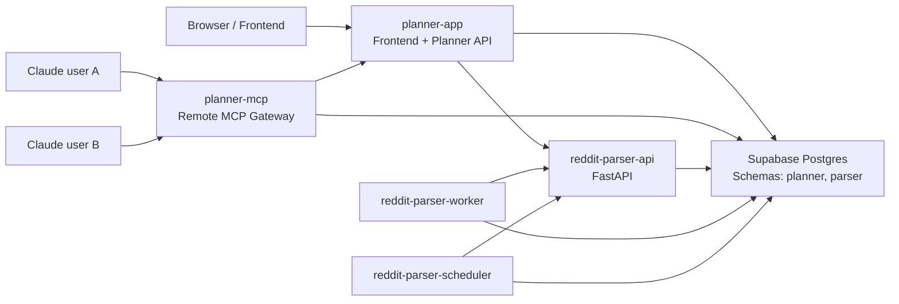

# Railway Production Architecture

## Status
Target architecture for production deployment on Railway with a shared Supabase Postgres database.

## Goal
Support:
- multi-user web access through the planner frontend
- multi-user Claude / MCP access from multiple devices
- parser-driven research workflows from a separate repository
- one shared operational environment with clear service boundaries

## Repositories
### Planner repository
- `Ba_post_planner`
- owns frontend, planner API, publishing orchestration, authentication, MCP gateway

### Parser repository
- `InnokentyB/reddit-parser`
- owns Reddit ingestion, parser jobs, worker execution, scheduler execution, insight extraction

## Deployment target
All runtime services are deployed to **one Railway project / one Railway environment**.

This enables:
- private service-to-service traffic over `*.railway.internal`
- one shared environment variable space per service
- one operational surface for rollout and observability

Railway private networking reference:
- [Railway Private Networking](https://docs.railway.com/networking/private-networking)

## Service topology
### Public services
1. `planner-app`
- source: `Ba_post_planner`
- responsibility: frontend + main application API
- public domain: yes

2. `planner-mcp`
- source: `Ba_post_planner`
- responsibility: remote MCP gateway for Claude
- public domain: yes

### Internal services
3. `reddit-parser-api`
- source: `InnokentyB/reddit-parser`
- responsibility: parser API for search jobs, templates, insights, summaries
- public domain: optional
- recommended exposure: internal only if Railway topology allows planner-only access; otherwise public with strict bearer auth

4. `reddit-parser-worker`
- source: `InnokentyB/reddit-parser`
- responsibility: continuous job processing
- public domain: no

5. `reddit-parser-scheduler`
- source: `InnokentyB/reddit-parser`
- responsibility: scheduled enqueueing of due parser template runs
- public domain: no

### Data service
6. `supabase-postgres`
- source: Supabase project
- responsibility: one Postgres instance shared by planner and parser through separate schemas

## High-level architecture

## Service responsibilities
### `planner-app`
Owns:
- user authentication
- project context
- planner data model
- publication plan import
- channel management
- content planning and publication APIs
- parser integration endpoints for frontend

Must not expose parser internals directly to the browser.

### `planner-mcp`
Owns:
- remote MCP transport for Claude
- MCP auth
- tool routing
- publication tools
- publication-plan asset tools
- parser tools exposed through planner-owned policies
- audit logging of tool usage

Should not bypass planner policy rules.

### `reddit-parser-api`
Owns:
- parser search job creation
- parser job status
- posts and comments retrieval
- templates
- insights
- summaries
- creator-signal endpoints

Should be treated as a backend capability service, not as the product-facing API.

### `reddit-parser-worker`
Owns:
- dequeueing and processing parser jobs
- Reddit API / browser collection
- enrichment and storage

### `reddit-parser-scheduler`
Owns:
- scheduled template reruns
- cron-like orchestration for parser jobs

## Integration principle
The parser is **not** a first-class frontend API.

Both frontend and MCP should use parser functionality through a planner-owned integration layer:
- frontend -> `planner-app` -> parser integration client -> `reddit-parser-api`
- MCP -> `planner-mcp` -> planner service layer -> parser integration client -> `reddit-parser-api`

This preserves:
- one auth model
- one permission model
- one audit trail
- one project/workspace mapping rule

## Project/workspace mapping
Recommended mapping:
- planner project id `42`
- parser workspace id `project:42`

This rule should be applied consistently in:
- planner backend parser client
- planner MCP tools
- parser job creation
- parser summaries / insights retrieval

## Authentication model
### Browser -> `planner-app`
- existing application auth
- project membership and role checks

### Claude -> `planner-mcp`
- dedicated MCP bearer token
- ideally one token per user or device
- scoped permissions for:
  - read tools
  - parser tools
  - import tools
  - publish tools

### `planner-app` -> `reddit-parser-api`
- service token
- parser API should reject unauthenticated calls

### `planner-mcp` -> `planner-app`
- internal service token if using planner API
- or direct shared domain service access if deployed as a code-sharing service and not as an API consumer

## Recommended network exposure
### Public
- `planner-app`
- `planner-mcp`

### Prefer internal
- `reddit-parser-api`
- `reddit-parser-worker`
- `reddit-parser-scheduler`

If `reddit-parser-api` must be public for deployment reasons:
- protect it with service auth
- do not expose it directly to frontend clients

## Runtime communication
Recommended Railway DNS names:
- `planner-app.railway.internal`
- `planner-mcp.railway.internal`
- `reddit-parser-api.railway.internal`

Frontend clients cannot use Railway private networking directly. Only server-side services can.

## Health endpoints
### `planner-app`
- `/api/health`
- `/api/health/deep`

### `planner-mcp`
- add `/health` on remote MCP server entrypoint

### `reddit-parser-api`
- `/health`

### Worker / scheduler
- no public healthcheck required if deployed as non-public processes

## Build and run commands
### `planner-app`
- build: `npm install && npm run build`
- run: `node dist/server.js`

### `planner-mcp`
- build: `npm install && npm run build:backend`
- run: `node dist/mcp/remote-server.js`

### `reddit-parser-api`
- build: `pip install -r requirements.txt`
- run: `./bin/start api`

### `reddit-parser-worker`
- build: `pip install -r requirements.txt`
- run: `./bin/start worker`

### `reddit-parser-scheduler`
- build: `pip install -r requirements.txt`
- run: `./bin/start scheduler`

## Required next implementation steps
The current repository already has:
- local stdio MCP server
- publication tools
- publication plan import tools
- asset/ref reading tools

The following production pieces still need implementation:
1. `planner-mcp` remote HTTP transport entrypoint
2. MCP authentication for remote use
3. planner-owned parser integration client
4. planner parser endpoints for frontend consumption
5. parser tool family routed through planner policy checks

## Why this architecture
This architecture is preferred because:
- two people can use Claude from separate devices against one shared MCP endpoint
- frontend and MCP use the same planner domain rules
- parser remains independently deployable and scalable
- service boundaries stay clear while sharing one Postgres instance

## Related docs
- [database-topology.md](/Users/innokentyb/Ba_post_planner/docs/database-topology.md)
- [railway-deployment-runbook.md](/Users/innokentyb/Ba_post_planner/docs/railway-deployment-runbook.md)
- [mcp-deployment.md](/Users/innokentyb/Ba_post_planner/docs/mcp-deployment.md)
